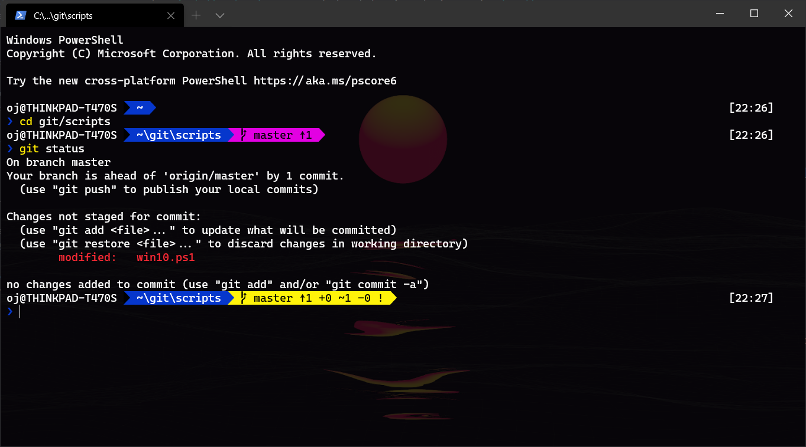

# windows-terminal-config

This is what it looks like...


---

### Requirements: -
**PowerShell modules**: `oh-my-posh` and `posh-git`\
**Font**: CascadiaCodePL

### Installation: -
1. In a PowerShell window, type
```
Import-Module posh-git
Import-Module oh-my-posh
```
2. Download and install `CascadiaCodePL.ttf` [from here](https://github.com/microsoft/cascadia-code/releases/download/v2005.15/CascadiaCode_2005.15.zip)

3. Copy `settings.json`, `terminal-bg.jpg` and `Microsoft.PowerShell_profile.ps1` to `C:\Users\%UserName%\AppData\Local\Packages\Microsoft.WindowsTerminal_8wekyb3d8bbwe\LocalState\`
